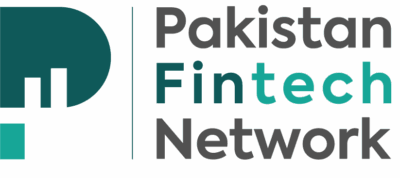
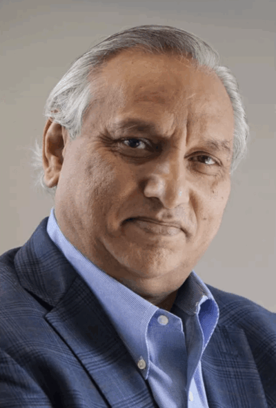
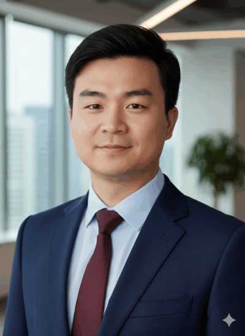
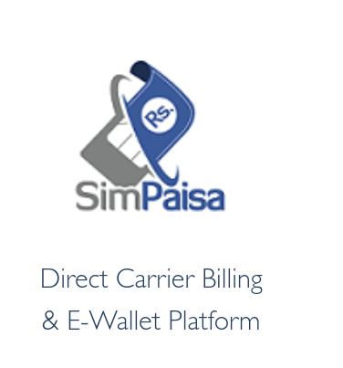
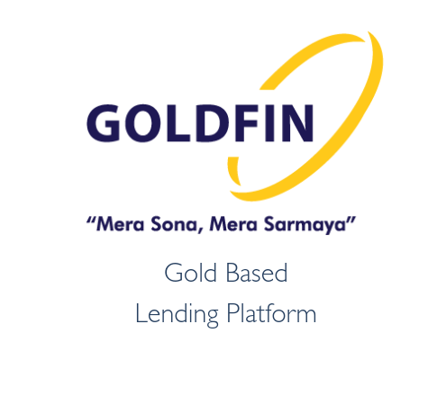
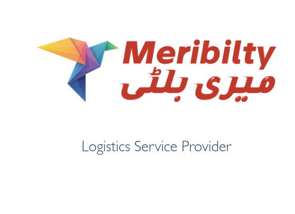

# U INFO LINK CONSULTANT 关键图文信息

## 品牌与视觉

- 品牌名称：U INFO LINK CONSULTANT
- 口号/品牌主张：We deliver result
- 视觉基调：以国家级政商资源与合规能力为核心的权威感与确定性

## 首页主视觉与核心叙事

- 主标题：巴基斯坦数字金融皇冠上的“导航者”与战略共创伙伴
- 标题辅助语：定义出海的确定性
- 核心叙事：巴基斯坦正处于数字化变革的前夜。U INFO LINK 的诞生，就是为了消除不确定性。我们为您提供直通巴基斯坦国家银行（SBP）和行业顶层资源的路径。
- 核心宣言：将您的技术优势，转化为巴基斯坦的战略资产。

## 关键能力与权威背书

- 凭借对 SBP 和 SECP 监管逻辑的深刻理解，确保过往项目均合规获批。
- Direct：作为 PFN 官方顾问，拥有直接参与政策探讨与监管沟通的专属通道。
- End-to-End：从主体设立到办公选址，从团队猎聘到 IT 审计，提供一站式落地托管。
- 生态伙伴资源：国家级战略储备的含金量，我们的合作伙伴不仅是服务商，更是深度绑定的利益共同体。

## 战略合作伙伴（原站展示）

- 战略合作伙伴：Pakistan Fintech Network（PFN）、Simpaisa、Raqami Digital Bank、Finja、Goldfin、Meribilty。

## PFN 关键价值（原站文字）

- 核心权力枢纽：PFN 是巴基斯坦国家数字金融战略的关键执行与协调机构，其成员涵盖该国所有主流银行、电信运营商和金融科技公司。
- 核心职能：政策倡导（代表行业与央行、证监会进行深度对话）、生态建设（连接投资者与监管沙盒）、标准制定。
- 合作伙伴获益：U INFO LINK 作为其官方中国顾问，可让合作伙伴在政策草拟阶段提前 6-12 个月掌握监管脉搏，将“被动合规”转变为“先发优势”。

## 核心智囊与顶层资源

- Nadeem Hussain：巴基斯坦数字金融“教父”，拥有近 50 年全球金融从业经验；Easypaisa 缔造者；PFN 主席；巴基斯坦即时支付系统 Raast 董事；央行（SBP）与财政部数字银行框架核心咨询顾问。
- 含金量体现：其背书可使中国企业在获取 EMI/Digital Bank 等牌照时具备“信任优先权”，可直接对话央行行长、财政部长及各大财团领袖。
- Mark Zhang：十年扎根巴基斯坦的本地化实战专家；PFN 官方中国顾问；负责将国家级战略红利与中国技术进行精准匹配；熟悉本地用工风险、外汇管制路径及支付网关规则。
- 执行力闭环：掌握巴基斯坦高级金融科技人才库，可在一月内组建经得起合规审计的核心高管团队。
- Watson Chen：纵贯军、政、商三界的资源总调度；建立直达总理府、军方高层及各部委首长的人脉网络；代表 PFN 官方意志推动政策沟通；擅长合规模型设计与利润回流架构。
- 生态资源掌控：深度掌握电信数据接口、第三方支付清算、供应链金融等核心底层资源，协助合作伙伴导入增长所需的基础设施与数据燃料。
- Barrister Hassaan Salahuddin 顶级法律矩阵：常年稳居《钱伯斯亚太榜单》第一等级（Band 1），擅长将复杂持股架构“翻译”为监管认可方案，是准入难题的顶级“拆弹专家”。
- 国际级财税顾问：巴基斯坦顶尖税务与商业咨询机构，深谙中巴双边税务协定，针对外汇管制设计最优利润汇回路径。

## 四大核心资产（原站结构）

- 金融与特许行业准入（牌照申请）：依托 PFN 身份与高层对话机制，消除审批黑箱，确保“拿牌”确定性。
- 全系金融牌照：EMI（电子货币机构）、NBFC（信贷）、Digital Bank（数字银行）、PSO/PSP（支付网关）等全系列金融许可证申领。
- 虚拟资产（VASP/Web3）准入：政策探索期获取“监管沙盒”试点或特区合规运营许可。
- 政府公关（GR）策略：代表企业与央行（SBP）和证监会（SECP）进行高层答辩，将中资技术优势翻译为当地监管认可方案。
- 极度合规架构与资产保护：解决资产安全与利润回流的核心痛点。
- 利润合法回流闭环：基于技术授权、咨询费及红利分配的合法外汇结转路径。
- “军政级”风险对冲：以深厚政商背景为中资资产建立法律与主权双重防护。
- 税务架构优化：离岸与在岸结构设计，匹配中巴税务协定，最小化整体税负。
- 本土化“交钥匙”交付：提供标准化落地执行，将蓝图转化为具备运营能力的实体。
- 管理层猎聘：筛选并考核懂监管、有银行背景的本地 C-Level 高管团队。
- 底层资源导入：打通 Raast、本地商业银行接口、电信运营商大数据 API。
- 物理资产安全：服务器本地化部署、数据中心建设、办公场地安全护航。
- 长期生态运营与增值：确保企业不仅“活下来”，更能“跑得快”。
- 常态化合规维护：定期监管风险预警、年度审计申报。
- 本地资本对接：对接本地家族财团、保险机构与中东/南亚风险投资基金。
- 危机公关：政策突变、法律纠纷或舆论波动时调动最高层级行政资源化解。

## 战略路径（Strategic Journey）

- 评估与架构：业务可行性深度评估，设计符合监管标准的持股与税务架构。
- 准入与获牌：主体设立与金融牌照申请，主导监管答辩与公关沟通。
- 交付与启动：猎聘核心团队，配置办公空间及 IT 合规审计。
- 长效合规：季度审计、税务申报及常年监管关系维护服务。

## 价值宣言

- 我们的价值不只是告诉您流程，我们是直接为您打开那扇门。
- 进得去：解决牌照与准入。
- 站得住：解决团队、安全与生态。
- 出得来：解决利润合规汇回。

## 联系方式

- Email: info@uinfolink.space
- Wechat: 17520490320
- Whatsapp: +92 3123488881

## 其他视觉素材（原站截图与标识）

